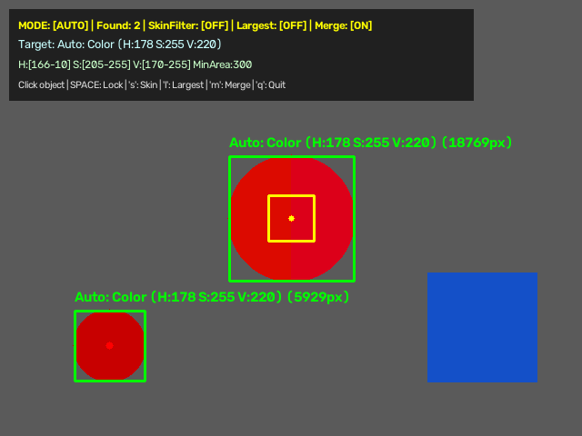
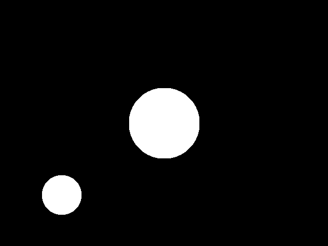

# 🎯 Real-Time Smart HSV Color & Object Detector

[](https://github.com/ShibilAhamed701212/HSV_Color_Detection/actions/workflows/ci.yml)
[](https://www.python.org/)
[](https://opencv.org/)
[](https://numpy.org/)

A real-time desktop computer-vision app, written in Python with **OpenCV**, that detects and tracks objects in a webcam feed by their color in HSV space. You point it at an object (or click on it), it works out a suitable HSV range, and it draws a bounding box around every matching region.

It handles saturated colors as well as neutral White / Black / Gray objects, supports red hues that wrap around the 0/180 boundary, can suppress skin tones, and merges fragmented detections into one box.

---

## ✨ Features

- 🎯 **Click to pick:** left-click an object in the video window to move the target box there, sample a 9×9 patch, compute HSV bounds and lock onto that color.
- ⚡ **Auto sampling:** while unlocked, the 50×50 target box is re-sampled every frame and the HSV sliders follow it.
- 🧠 **Smart bounds:** the sampled patch is classified as White, Black, Gray or a saturated Color, and each case gets its own Hue/Saturation/Value window (see [`calculate_smart_hsv_bounds`](util.py)).
- 🔄 **Hue wraparound:** reds straddling hue 0/179 are matched with a two-range mask. This applies to the Red preset and to auto/click sampling (the sampled hue uses a circular median).
- 🛡️ **Skin filter:** optionally removes pixels in a skin-tone HSV range (H 0–25, S 25–140, V 60–255) from the mask.
- 📦 **Box merging:** bounding boxes within 50 px of each other are merged, so an object split by a reflection or shadow is reported once.
- 🎛️ **Control panel:** OpenCV trackbars for H/S/V min/max and the minimum contour area (floor of 50 px).
- 🎨 **Presets:** number keys load fixed ranges for Red, Green, Blue, Yellow, Orange, Purple, White and Black.
- 📊 **HUD:** a semi-transparent overlay shows mode, number of detections, filter states, current HSV range and key hints.

---

## 🖼️ Interface

The app opens three OpenCV windows:

| Window | Contents |
| :--- | :--- |
| **HSV Color Detection** | Live camera frame with the target box (yellow in auto mode, orange when locked/manual), green bounding boxes with label and box area, red center dots, and the HUD |
| **Binary Mask** | The cleaned binary mask the contours are found in |
| **Control Panel** | Trackbars: `H Min`, `H Max`, `S Min`, `S Max`, `V Min`, `V Max`, `Min Area` |

The screenshots below are genuine output of `main.py`, but the input is a **synthetic test scene** fed in place of a webcam by [`scripts/synthetic_demo.py`](scripts/synthetic_demo.py), not a real camera frame. The big disc is red with its halves at hue ≈1 and ≈177; auto mode samples it and both red objects are detected while the blue block is ignored.

| Detection window (auto mode) | Binary mask |
| :---: | :---: |
|  |  |

---

## 🎮 Controls

| Input | Action |
| :--- | :--- |
| **Left click** (video window) | Move the target box to the clicked pixel, compute smart bounds and lock the color |
| **`Space`** | Lock / unlock the current HSV bounds |
| **`a`** | Toggle auto sampling (also unlocks) |
| **`s`** | Toggle the skin filter |
| **`l`** | Toggle "largest object only" (box merging is skipped in this mode) |
| **`m`** | Toggle box merging |
| **`1`–`6`** | Presets: `1` Red, `2` Green, `3` Blue, `4` Yellow, `5` Orange, `6` Purple |
| **`7` / `8`** | Presets: `7` White, `8` Black |
| **`q`** | Quit |

Choosing a preset or clicking switches auto sampling off and locks the color. Dragging the trackbars works when the color is locked or auto mode is off; in auto mode they are overwritten every frame.

---

## 🛠️ Project Structure

```text
HSV_Color_Detection/
├── main.py                    # App: camera loop, mouse/keyboard handling, masks, HUD
├── util.py                    # HSV bounds, circular hue median, (wrap-aware) mask building and cleaning, box merging
├── tests/test_util.py         # pytest suite for util.py
├── scripts/synthetic_demo.py  # Runs main.py on a synthetic scene and saves screenshots
├── docs/screenshots/          # Screenshots produced by the script above
├── requirements.txt           # Runtime dependencies (opencv-python, numpy)
├── requirements-dev.txt       # Test/lint tools (pytest, ruff)
├── pytest.ini                 # pytest configuration
├── pyrightconfig.json         # Editor type-checker settings
└── .github/workflows/ci.yml   # GitHub Actions: ruff + pytest on Python 3.9 / 3.11 / 3.12
```

`util.py` also contains `get_limits`, `get_color_mask` and `get_bounds_from_sample`, earlier helpers that turn a single BGR color or HSV pixel into bounds. `main.py` does not use them, but they are tested and can be used on their own.

---

## 🔬 How It Works

1. **Capture:** frames come from camera index 0, falling back to index 1. The app exits with an error if neither opens.
2. **Pre-processing:** an 11×11 Gaussian blur, then BGR → HSV conversion.
3. **Bounds:** in auto mode the median H/S/V of the target box decides the case (White if S < 40 and V > 160, Black if V < 60, Gray if S < 35, otherwise Color with H ±12, S −50/+60, V −50/+60). The bounds are pushed to the trackbars, which are then read back.
4. **Masking:** `cv2.inRange` with the trackbar values; when `H Min > H Max` two ranges are OR-ed to cover the hue wrap. The skin mask is subtracted if enabled.
5. **Cleaning:** morphological opening (5×5 kernel) removes specks, closing (two iterations) fills holes.
6. **Contours:** external contours larger than `Min Area` are kept, optionally reduced to the largest one, converted to bounding boxes and merged when close.
7. **Drawing:** boxes, labels, target box and HUD are drawn and shown alongside the mask.

---

## 🚀 Getting Started

### Requirements

- Python 3.9 or newer
- A webcam
- A desktop session (the app opens OpenCV GUI windows)

### Install and run

```bash
git clone https://github.com/ShibilAhamed701212/HSV_Color_Detection.git
cd HSV_Color_Detection

python3 -m venv .venv
source .venv/bin/activate        # Windows: .venv\Scripts\activate

pip install -r requirements.txt
python main.py
```

There is no configuration file or environment variable; everything is controlled from the windows and the keyboard.

---

## 🧪 Testing

The unit tests cover `util.py` (bound calculation and the dual-range mask including red wraparound, box merging, mask cleaning and the legacy helpers). They need no camera or display, so the headless OpenCV build is enough:

```bash
pip install opencv-python-headless "numpy>=1.23.0" -r requirements-dev.txt
ruff check .
pytest
```

Do not install `opencv-python` and `opencv-python-headless` in the same environment; they conflict. CI runs the commands above on every push to `main` and every pull request.

To reproduce the screenshots (needs `opencv-python` and a display, or Xvfb on Linux):

```bash
xvfb-run -a python scripts/synthetic_demo.py
```

---

## 🩹 Fixed Issues

- **Red objects were tracked as cyan or only half detected (auto/click sampling).** The sampled hue was a plain median, so a red patch with pixels near both 0 and 179 produced a median around 89 (cyan), and a red near 3 got a clamped range of 0–15 that missed the 170s. The hue median is now circular and the range wraps, which `main.py` already masked correctly.
- `current_hsv_frame` is initialised before the mouse callback is registered.
- The app uses `sys.exit` instead of the `site`-provided `exit`.
- The Space-bar unlock message no longer claims auto sampling when auto mode is off.
- Removed `Pillow` from `requirements.txt`; nothing imports it.

---

## ⚠️ Known Limitations

- **Lighting-dependent:** fixed HSV thresholds react to lighting, white balance and camera auto-exposure; expect to re-pick colors when lighting changes.
- **Skin filter overlap:** the skin range (H 0–25) also covers much of orange, yellow-orange and red, so enabling it can hide those objects.
- **Neutral colors are broad:** White/Black/Gray modes accept every hue, so any bright, dark or gray background region of similar brightness will match.
- **Single color at a time:** only one HSV range is tracked per frame, and every box gets the same label.
- **No tracking identity:** each frame is detected independently; there is no object ID or motion tracking.
- **Fixed camera:** the camera index (0, then 1) and the 50 px target box / merge distance are hard-coded.
- **Not verified on a real camera in CI:** automated checks cover `util.py` and the synthetic-scene run; webcam behaviour has not been verified here.
- **License:** an MIT license was stated previously, but the repository does not contain a `LICENSE` file yet.
